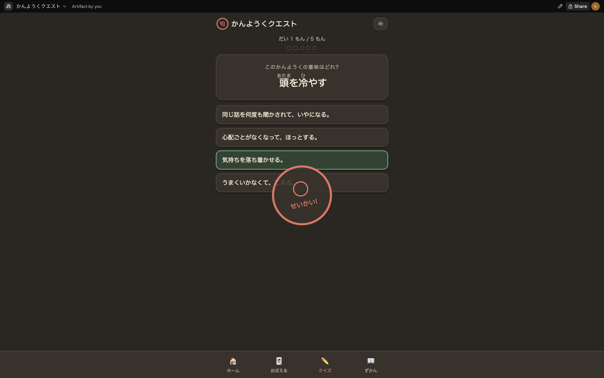
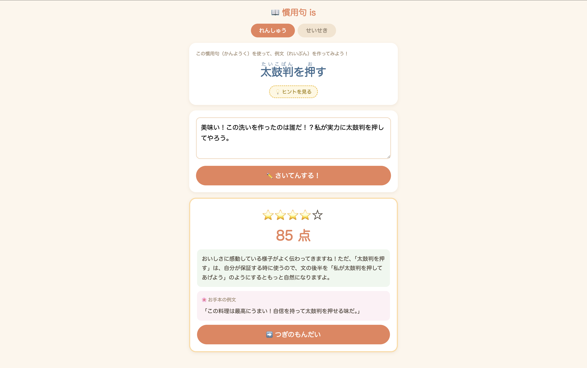

# 究極の慣用句アプリ対決

小学生の娘に慣用句を身につけてもらうため、**AIと人間がそれぞれ独立にアプリを企画・実装**した対決プロジェクトです。

どちらが作ったか本人にわからないよう、**デザイン（見た目）は両方ともAIが担当**しています。勝敗を決めるのは、実際に使う娘です。

## 対戦カード

| | [`ai/` かんようくクエスト](./ai/README.md) | [`human/` 慣用句 is](./human/README.md) |
| --- | --- | --- |
| 企画・実装 | 🤖 AI | 🥸 人間 |
| 画面 |  |  |
| アプローチ | インプット重視（カード・クイズ・スタンプ集めで覚える） | アウトプット重視（例文を作文し、AIが採点・フィードバック） |
| 収録数 | 50語 | 70問 |
| 技術 | 単一HTMLファイル（依存なし・オフライン可） | Node.js + Express + Ollama（またはClaude API） |
| 起動 | `ai/index.html` をブラウザで開くだけ | サーバー起動が必要（下記） |

## 動かし方

### ai/ — かんようくクエスト

```bash
open ai/index.html
```

インストール・外部通信は不要です。進捗はブラウザの localStorage に保存されます。

### human/ — 慣用句 is

[mise](https://mise.jdx.dev/) と Ollama が必要です。詳細は [human/README.md](./human/README.md) を参照してください。

```bash
cd human
mise install                    # 初回のみ
pnpm install --frozen-lockfile  # 初回のみ
PORT=3456 pnpm start
```

ブラウザで http://localhost:3456 を開きます。同じWi-Fi内のタブレットからは `http://<このMacのIP>:3456` でアクセスできます。

## ルール

- 企画・実装はAIと人間がそれぞれ独立に行う
- デザインは両方ともAIが担当し、作者を判別できないようにする
- 判定は利用者（娘）の反応で決める
- 結果は以下に！
  - https://zenn.dev/xtm_blog/articles/b2fa2987b93980
